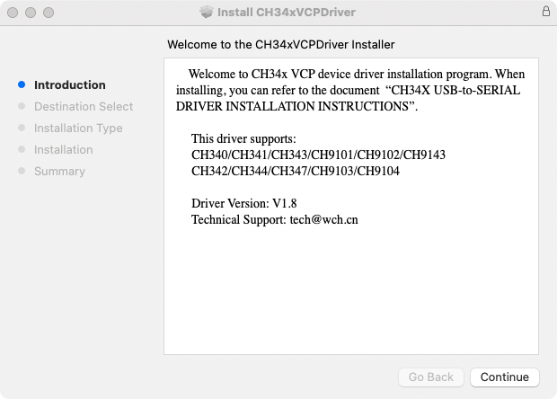
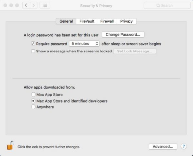

# ch34xser_macos
## ***\*Introduction\****

This installation guide document shows the procedure of installing the macOS driver for the WCH USB-to-SERIAL devices. The driver can be downloaded from the website:
Link: http://www.wch.cn/downloads/CH34XSER_MAC_ZIP.html

## ***\*System Requirement\****

- OS X 10.9 to OS X 10.15
- OS X 11.0(Big Sur) and above

## ***\*Chip Model Support\****

- CH340/CH341/CH343/CH9101/CH9102/CH9143 (USB to Single Serial Port)
- CH342/CH344/CH344/CH347/CH9103/CH9104 (USB to Multi Serial Ports)

## ***\*Installation\****

1. Download the driver from the website and unzip the file to a local installation directory.

2. When using OS X 11.0 and above and the OS does not support Rosetta, the dmg format driver should be installed (follow step4), otherwise the pkg format driver should be installed by default (follow step3).

3. When installing the pkg format driver, click on the driver file and continue to proceed step by step.

 

 

When installing the pkg format driver on OS X 11.0 and above, you need to perform the following additional operation:

Open “LaunchPad” and find “CH34xVCPDriver” Application, open the App and click the “Install” button.

 

When using OS X 10.9 to OS X 10.15, you need to click “Restart” to restart your computer, then perform the following steps after restarting.

 

4. When installing the dmg format driver, you need to click the dmg file and drag “CH34xVCPDriver” into Application folder in OS, then open “LaunchPad” and find “CH34xVCPDriver” Application, open the App and click the “Install” button.

    

5. When plug the USB-to-SERIAL device into the USB port, you can open “System Report”->Hardware->USB, the right side is “USB Device Tree” and you will find a device whose “Vendor ID” is **[0x1a86]** if USB device is working properly.

 

6. Open Terminal program under Applications-Utilities folder and type the command “ls /dev/tty*”.

 

You should see the “tty.wchusbserialx” where “x” is the assigned device number similar to Windows COM port assignment. 

 

## ***\*Note:\****

Mac OS High Sierra 10.13 introduces a new feature that requires user approval before loading new third-party kernel extensions. Go to System Preferences - Security & Privacy and click Allow. 

Link: https://developer.apple.com/library/content/technotes/tn2459/_index.html

Please enter “System Preferences”->“Security & Privacy”->“General” page, below the title “Allow apps downloaded from:” choose the choice 2->”Mac App Store and identified developers” so that driver will work normally.

 

## ***\*Uninstall Driver\****

- OS X 10.9~10.11 

Open "Terminal" program under Applications-Utilities folder and type the following commands:

***\*sudo rm -rf  /Library/Extensions/CH34xVCPDriver.kext\****

***\*sudo rm –rf /var/db/receipts/\*CH34xVCPDriver\*.\*\**** 

- OS X 10.12~10.15 

Open “Terminal” program under Applications-Utilities folder and type the following commands:

***\*sudo rm -rf /Library/Extensions/CH34xVCPDriver.kext\****

***\*sudo rm -rf /Library/Extensions/CH34xVCPControlDriver.kext\****

***\*sudo rm –rf /var/db/receipts/\*CH34xVCPDriver\*.\*\**** 

***\*sudo rm –rf /var/db/receipts/\*CH34xVCPControlDriver\*.\*\**** 

- OS X 11.0 and above

1. Remove the Application to “Trash” to uninstall.

2. Restart the computer again before reinstalling the driver.

 
