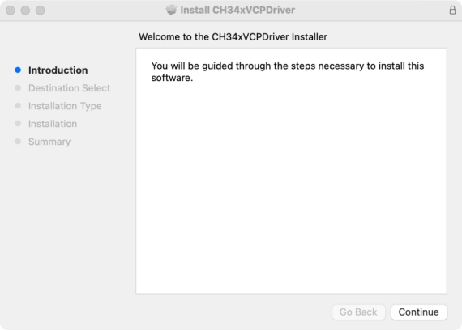
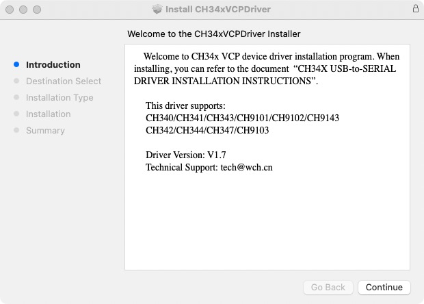
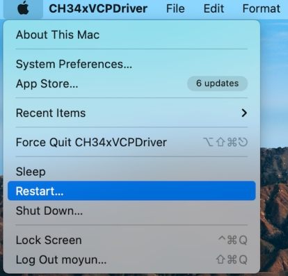

# ch34xser_macos
## ***\*Introduction\****

This installation guide document shows the procedure for installing the Mac OS driver for the WCH USB-to-SERIAL devices.

## ***\*System Requirement\****

- OS X 10.9 to OS X 10.15
- OS X 11.0(Big Sur) and above

## ***\*Chip Model Support\****

- CH340/CH341/CH343/CH9101/CH9102
- CH342/CH344/CH9103

## ***\*Installation\****

1. Download the driver from the website and unzip the file to a local installation directory.

2. Click on the driver file and continue to proceed step by step.

 

 

 

When using OS X 11.0 and above, you need to perform the following additional operation:

Open “LaunchPad” and find “CH34xVCPDriver” Application, open the App and click the “Install driver” button.

 

3. Click “Restart” to restart your computer.

 

4. After rebooting your computer, you can plug in the USB-to-SERIAL device into the USB port. Open “System Report”->Hardware->USB, the right side is “USB Device Tree” and there will be device named “Vendor-Specific Device” if USB device is working properly.

 

5. Open Terminal program under Applications-Utilities folder and type the command “ls /dev/tty*”.

 

You should see the “tty.wchusbserialx” where “x” is the assigned device number similar to Windows COM port assignment. 

 

## ***\*Note:\****

Mac OS High Sierra 10.13 introduces a new feature that requires user approval before loading new third-party kernel extensions. Go to System Preferences - Security & Privacy and click Allow. 

Link: https://developer.apple.com/library/content/technotes/tn2459/_index.html

Please enter “System Preferences”->“Security & Privacy”->“General” page, below the title “Allow apps downloaded from:” choose the choice 2->”Mac App Store and identified developers” so that driver will work normally.

 

## ***\*Uninstall Driver\****

- Mac OS X 10.9~10.15 

Open Terminal program under Applications-Utilities folder and type the following commands:

***\*sudo rm -rf  /Library/Extensions/CH34xVCPDriver.kext\****

***\*sudo rm –rf /var/db/receipts/\*CH34xVCPDriver\*.\*\**** 

- Mac OS X 11.0 and above

1. Remove the Application to “Trash” to uninstall.

2. Restart the computer again before reinstalling the driver.

 
